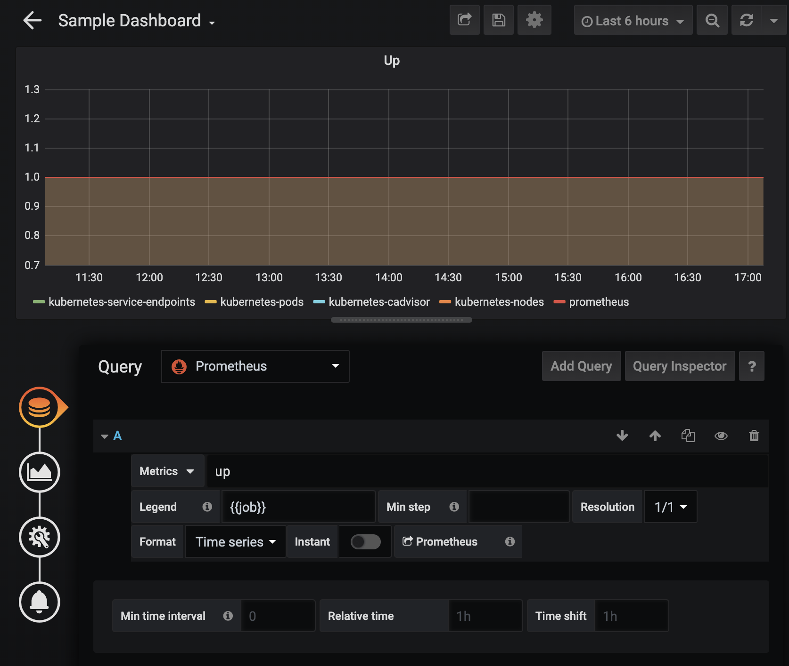

# Accessing Prometheus via external services

Prerequisites:

- An existing GitLab-managed cluster with Prometheus installed.
- At least one deployment running on the cluster.

## Exposing the Prometheus endpoint for a GitLab-managed cluster

> The following instructions are for
> [Google Kubernetes Engine (GKE)](https://cloud.google.com/kubernetes-engine).
> If you are using a local cluster such as Minikube, you only need to find the
> external IP address and port of the Prometheus service.

1. Log in to the cluster management page in GKE. For the Monitor stage, this is the [monitoring-development cluster](https://console.cloud.google.com/kubernetes/list?project=monitoring-development-241420).
1. Navigate to **Services & Ingress**.
1. Filter for `Name:prometheus-prometheus-server`, find the instance for your cluster, and click to open it.
1. Scroll down to **Ports** and copy the **Target Port**.
1. Open the deployment under **Deployments**.
1. Under the **Actions** dropdown, select **Expose**.
   - **Port**: Select a port. For example, 60000.
   - **Target Port**: Select the Target Port found in Step 4, e.g. 9090.
   - **Protocol**: Leave as-is (e.g. TCP).
   - **Service Type**: Load balancer.
1. Click **Save**. The UI will open a page for the load balancer service. The external
   IP address and port will be visible under the **External endpoints** field.

   Note: It may take several minutes for the load balancer to become operational.

Once complete, you may access the Prometheus server at the IP address and port shown.
You can test this by accessing the `/graph` endpoint. The Prometheus UI should be
visible there. That is, at `http://<IP address>:<port>/graph`.

Reference documentation:

- [Creating a Service of Type LoadBalancer](https://cloud.google.com/kubernetes-engine/docs/how-to/exposing-apps#creating_a_service_of_type_loadbalancer)
- [Prometheus Expression Browser](https://prometheus.io/docs/visualization/browser/)

## Connecting Grafana to a GitLab-managed Prometheus instance

1. Get a Grafana instance. _Note: The Grafana instance must be network-accessible from the GDK, and your Prometheus must be network-accessible from the Grafana instance._
   1. Create a local instance. Run `docker run -d -p 3000:3000 grafana/grafana` to spin up a local Grafana instance (default username/password: `admin`/`admin`).
   1. Create a cloud instance, ensuring that visibility is set to 'public'. Note that this may have usage costs.
1. Add a DataSource of type **Prometheus**.
1. In the URL field, add `http://<ip>:<port>` as detailed in
   [Exposing the Prometheus endpoint for a GitLab-managed cluster](#exposing-the-promtheus-endpoint-for-a-gitlab-manged-cluster).
1. Click **Save**.
1. Create a dashboard using Prometheus metrics. Refer to the following screenshot:

   

## How to connect Grafana to GitLab

Refer to the documentation on [Embedding Grafana charts](https://docs.gitlab.com/ee/user/project/integrations/prometheus.html#embedding-grafana-charts)
for details on configuring GitLab to integrate with Grafana.
